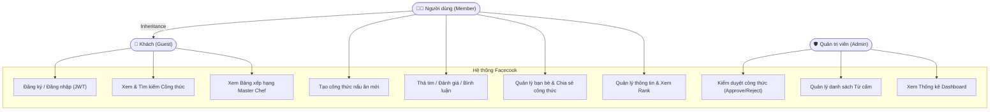
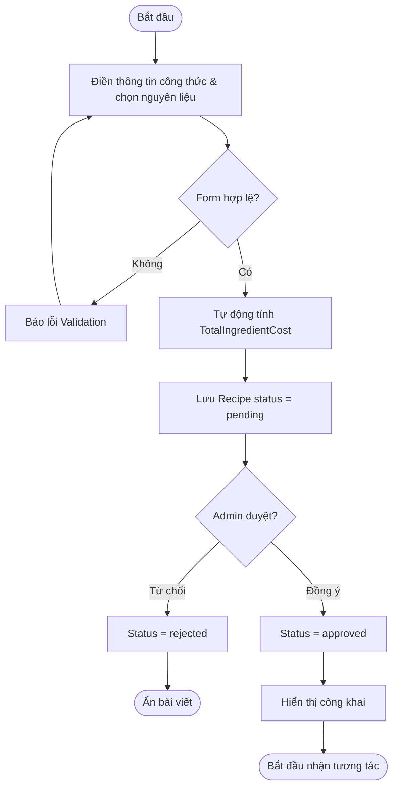
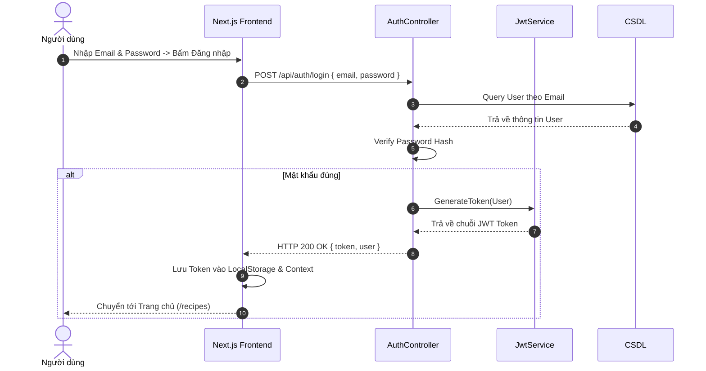
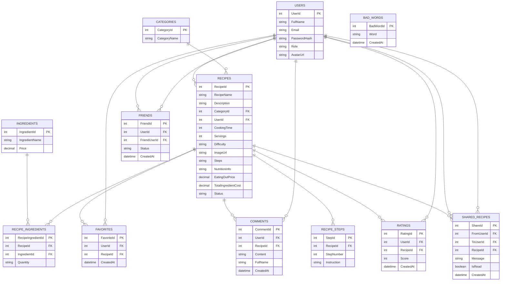

# 📑 BÁO CÁO MÔN HỌC: PHÂN TÍCH & THIẾT KẾ HỆ THỐNG THÔNG TIN
## ĐỀ TÀI: MẠNG XÃ HỘI CHIA SẺ CÔNG THỨC NẤU ĂN & TÍNH TOÁN CHI PHÍ (FACECOOK)

- **Repository GitHub**: [https://github.com/truongadu/truong227.github.io.git](https://github.com/truongadu/truong227.github.io.git)
- **GitHub Project Board**: FaceCook Project (`truongadu / Projects / FaceCook Project`)
- **Phiên bản hệ thống**: 1.0.0
- **Ngày hoàn thành**: 06/08/2026

---

# 2. QUẢN LÝ DỰ ÁN TRÊN GITHUB (2 ĐIỂM)

## 2.1. Phân công Nhân sự trên GitHub Projects

Dự án được quản lý trực quan trên **GitHub Projects (FaceCook Project)** với sự tham gia của 5 thành viên:

| STT | Họ tên / GitHub Username | Vai trò | Phân công nhiệm vụ trên GitHub Projects |
|---|---|---|---|
| 1 | **`ngynfet`** | **PM / UI-UX** | Quản lý tiến độ dự án, Thiết kế Wireframe, Prototype, Design System (`#16`) |
| 2 | **`khuatduychithanh`** | **Backend 1** | Xây dựng CSDL Core, EF Core DbContext, Recipes API, Cost Calculation & Admin (`#17`) |
| 3 | **`Tientran1511`** | **Backend 2** | Auth JWT API, User Profile, Social APIs (Comments, Ratings, Favorites, BadWords) (`#18`) |
| 4 | **`hoangnamtq0309-boop`** | **Frontend 1** | Setup Next.js 14 App Router, Catalog Công thức, Search & Filter, Leaderboard (`#19`) |
| 5 | **`truongadu`** *(Leader)* | **Frontend 2** | Submit Recipe Form, Recipe Detail Dialog, Social Interactions UI & Admin Dashboard (`#20`) |

---

## 2.2. Repository & Cấu trúc Nhánh (Branching Strategy)

Dự án áp dụng quy trình quản lý mã nguồn chuẩn **Git Flow**:

```
main (Production Release)
 └── develop (Nhánh tích hợp tính năng)
      ├── feature/auth           (Sprint 1: Nền tảng & Xác thực JWT)
      ├── feature/recipe-core    (Sprint 2: Đăng bài, Tìm kiếm & Tính chi phí)
      ├── feature/social         (Sprint 3: Thả tim, Bình luận & Kết bạn)
      ├── feature/admin-rank     (Sprint 4: Kiểm duyệt bài & Bảng xếp hạng)
      └── fix/badwords-filter    (Sửa lỗi bộ lọc từ cấm)
```

## 2.3. Quy chuẩn Commit (Conventional Commits)
Toàn bộ lịch sử commit tuân thủ định dạng chuẩn `type(scope): Description`:
- `feat(auth)`: Thêm chức năng xác thực JWT cho người dùng.
- `feat(recipe)`: Thêm API tự động tính tổng chi phí nguyên liệu.
- `fix(social)`: Sửa lỗi bộ lọc từ cấm trong bình luận.
- `docs(readme)`: Thêm tài liệu hướng dẫn cài đặt và chạy ứng dụng.

## 2.4. Milestones, Issues & Backlog User Stories
- **Sprint 1 (#11)**: Nền tảng Auth & Setup API/UI (100% Completed).
- **Sprint 2 (#12)**: Quản lý công thức & Tính chi phí nguyên liệu (100% Completed).
- **User Stories (Backlog)**:
  - `US06`: Lưu món yêu thích (`#6`)
  - `US07`: Tạo thực đơn tuần (`#7`)
  - `US08`: Tìm kiếm món ăn (`#8`)
  - `US09`: Đánh giá món ăn (`#9`)
  - `US10`: Quản lý cơ sở dữ liệu món ăn (`#10`)

---

# 3. PHÂN TÍCH & THIẾT KẾ HỆ THỐNG (2 ĐIỂM)

## 3.1. Problem Statement (Bài toán thực tế)
1. **Thiếu định hướng món ăn**: Việc tìm kiếm công thức tản mát, thiếu định lượng nguyên liệu cụ thể.
2. **Khó quản lý chi phí**: Người dùng không biết chính xác chi phí nguyên liệu và liệu tự nấu tại nhà có tiết kiệm hơn đi ăn ngoài hàng hay không.
3. **Thiếu kết nối cộng đồng**: Người đam mê nấu ăn thiếu không gian chuyên biệt để giao lưu, chia sẻ thành quả và nhận đánh giá từ cộng đồng.

## 3.2. Business Requirement (Yêu cầu nghiệp vụ)
1. **Mạng xã hội Ẩm thực**: Đăng tải, tìm kiếm công thức; thả tim, bình luận, đánh giá sao, kết bạn và chia sẻ bài viết.
2. **Tính toán chi phí**: Tự động tính tổng chi phí tự nấu (`TotalIngredientCost`) và so sánh với giá đi ăn ngoài (`EatingOutPrice`).
3. **Bảng xếp hạng Danh vọng**: Phân cấp Rank (Đồng, Bạc, Vàng, Bạch Kim, Kim Cương) và vinh danh Top Master Chef.
4. **Kiểm duyệt an toàn**: Admin duyệt công thức và tự động lọc từ cấm trong bình luận.

## 3.3. Functional Requirement (Yêu cầu chức năng)
- **Auth**: Đăng ký, đăng nhập JWT, quản lý profile & rank badge.
- **Recipe**: Tạo công thức, xem chi tiết, tìm kiếm/lọc công thức, tự tính chi phí nguyên liệu.
- **Social**: Thả tim, bình luận (lọc BadWords), đánh giá rating 1-5 sao, kết bạn, chia sẻ công thức.
- **Admin & Leaderboard**: Thống kê dashboard, duyệt bài, quản lý từ cấm, vinh danh Top Master Chef.

## 3.4. Non-functional Requirement (Yêu cầu phi chức năng)
- **Bảo mật**: Mã hóa password, xác thực JWT RBAC (`User`, `Admin`), BadWords Middleware.
- **Hiệu năng**: Thời gian phản hồi API < 300ms, hỗ trợ phân trang (Pagination).
- **Giao diện**: Responsive 100%, hỗ trợ Dark/Light Theme, Lucide Icons & shadcn/ui.

---

## 3.5. Use Case Diagram



---

## 3.6. Activity Diagram (Sơ đồ Hoạt động)



---

## 3.7. Sequence Diagram (Sơ đồ Tuần tự Auth JWT)



---

## 3.8. Sơ đồ Thực thể Liên kết (ERD Diagram Full)



---

## 3.9. Kiểm thử Hệ thống (Testing)

### Danh sách Test Cases Tiêu chuẩn (Trích xuất 17 Test Cases Cốt lõi)

| Mã TC | Phân hệ | Tên Test Case | Input / Điều kiện | Expected Result | Result |
|---|---|---|---|---|---|
| TC-AUTH-01 | Auth | Đăng ký tài khoản | Email hợp lệ chưa có trong DB | Tạo User thành công, HTTP 200 | **Pass** |
| TC-AUTH-02 | Auth | Đăng ký trùng Email | Email đã có trong DB | HTTP 400 Bad Request | **Pass** |
| TC-AUTH-03 | Auth | Đăng nhập đúng | Nhập đúng Email & Password | Trả về JWT Token hợp lệ | **Pass** |
| TC-AUTH-04 | Auth | Đăng nhập sai pass | Mật khẩu sai | HTTP 401 Unauthorized | **Pass** |
| TC-REC-01 | Recipe | Tạo công thức mới | Điền đủ form và nguyên liệu | Tạo Recipe status `pending` | **Pass** |
| TC-REC-02 | Recipe | Tính chi phí tự nấu | Nguyên liệu có đơn giá chuẩn | Tự tính `TotalIngredientCost` | **Pass** |
| TC-REC-03 | Recipe | Admin duyệt công thức | Admin bấm Approve | Status đổi sang `approved` | **Pass** |
| TC-REC-04 | Recipe | Admin từ chối bài | Admin bấm Reject | Status đổi sang `rejected` | **Pass** |
| TC-REC-05 | Recipe | Tìm kiếm công thức | Nhập từ khóa món ăn | Hiển thị kết quả tìm kiếm | **Pass** |
| TC-SOC-01 | Social | Thả tim bài viết | Nút thả tim | Thêm/Xóa record `Favorites` | **Pass** |
| TC-SOC-02 | Social | Viết bình luận | Nhập bình luận thường | Tạo `Comment` mới | **Pass** |
| TC-SOC-03 | Social | Bộ lọc BadWords | Nhập từ tục tĩu | Báo lỗi & chặn gửi bình luận | **Pass** |
| TC-SOC-04 | Social | Đánh giá sao | Chọn 5 sao | Cập nhật điểm rating bài viết | **Pass** |
| TC-SOC-05 | Social | Gửi lời mời kết bạn | Bấm Thêm bạn | Tạo record `Friends` status `pending` | **Pass** |
| TC-SOC-06 | Social | Chấp nhận kết bạn | Bấm Chấp nhận | Status chuyển sang `accepted` | **Pass** |
| TC-SOC-07 | Social | Chia sẻ công thức | Chọn bạn bè & gửi | Tạo record `SharedRecipes` | **Pass** |
| TC-ADM-01 | Admin | Thêm từ cấm | Admin thêm từ mới | Cập nhật bảng `BadWords` | **Pass** |
